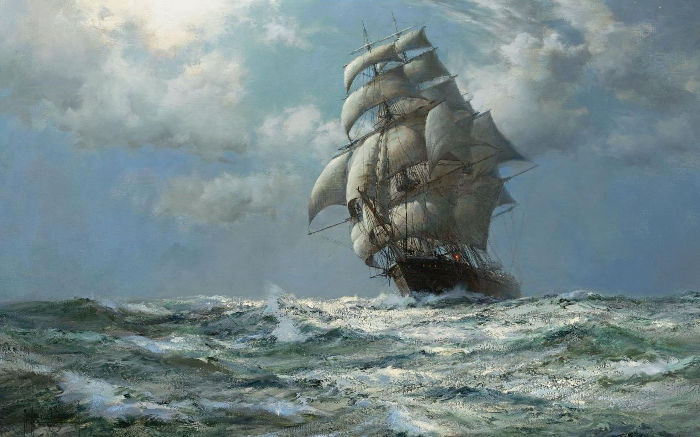
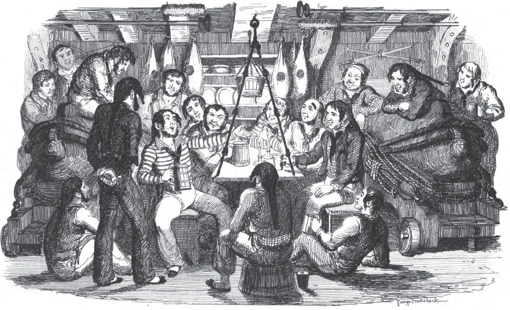
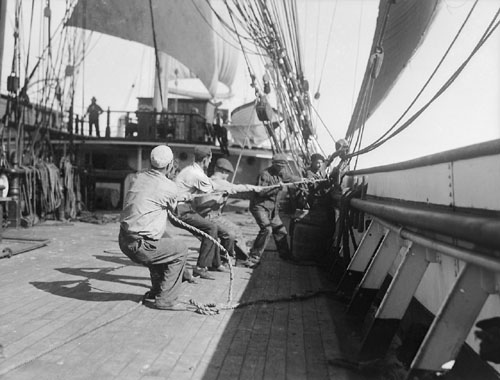

# Casting Neural Nets to Catch a Sea Shanty

#### Contents:
- [Introduction](#Introduction)
- [Data](#Data)
    * [Data Collection](#Data-Collection)
    * [Data Cleaning](#Data-Cleaning)
    * [Data Dictionary](#Data-Dictionary)
- [Modeling](#Modeling)
    * [Model Preparation](#Model-Preparation)
    * [Model Processing](#Model-Processing)
- [Results](#Results)
    * [Conclusions](#Conclusions)
    * [Recommendations and Next Steps](#Recommendations-and-Next-Steps)

## Introduction
Sea Shanties are a type of work song used on sailing vessels to help the crew keep in time for tasks such as hauling lines. For a more detailed history please refer to this [wikipedia](https://en.wikipedia.org/wiki/Sea_shanty) article.

One may wonder why spend the time to each a computer to write a sea shanty. To that I say what better way to showcase the capabilities of machine learning then to have a computer write a niche style of working song.

In reality though I wanted to present a project displaying several skillsets.

To do this I leverage skills from web scraping to machine learning all in python.

Also shanties are just fun to sing and so the world should have a few more.

## Data
In order for a neural net to have enough data to learn effectively I would need as many shanties as could be found. Given the small niche of the musical styling there are no large repositories of lyrics.

Instead five sites listing the lyrics of shanties were searched, reviewed, then selected for scraping.
- https://www.contemplator.com/sea/
- https://www.karaoke-lyrics.net/lyrics/sea-shanty-56697
- https://www.sailorsongs.com/index.html
- http://www.shantynet.com/
- http://www.traditionalmusic.co.uk/sea-shanty/0sea-shanty.htm

### Data Collection
For each site a custom web scraper *relative link to scraping folder* was written to pull the song title and the accompanying lyrics into a csv file.

The tools used for scraping were depending on how the sites were built. Primarily the python [requests](https://requests.readthedocs.io/en/master/) library was used but where sites had dynamic javascript the [selenium](https://www.selenium.dev/) webdriver was deployed.

### Data Cleaning
For the neural network to learn the lyrics from each song need to be combined into one large corpus. All on letter characters were removed and every character was converted to lowercase as a first pass for model learning.

## Modeling
[modeling-code](./code/model/model-building/model-building.ipynb)

Model idea and code inspired by and copied from Jason Brownlee at https://machinelearningmastery.com/text-generation-lstm-recurrent-neural-networks-python-keras/

Idea is to feed in a line and have the model predict a number of characters afterwards in an effort to mimic song writing. Multiple seed lines ordered in different ways can be manipulated to become a chorus to give the songs the call response rhythm that is prevalent in many shanties.

### Model Preparation
Model preparation consisted of two main parts
- Telling the network how to review processed data
  - Converting characters to something a neural net can learn from
- Telling the network how to review processed data

#### Data Conversion
To convert the characters of the corpus into something machine readable a dictionary was created with each unique character being a key and with a number as the value.

Next the data was parsed into 50 character sequences then reshaped as an array. The sequence was then shifted one character, reshaped, and added to the training data set. This process was done for the entire corpus.

### Model Processing

LSTM network was chosen for the memory aspects. I wanted the model to be able to remember enough to create a novel lyric.

In an effort to prevent gibberish from being the output a robust dual layer LSTM with dropout was fitted.

## Results

Seed string to base predictions on:

"Washington DC is the best campus of General Assemb"

This forced the model to predict a character on a unfinished word.

For results by each epoch refer to [lyrics-generator](./code/model/lyric-generation/lyrics-generator.ipynb) notebook

-Epoch 1:
Washington DC is the best campus of General Assembn the sail the sailor sail the sailor sail the sailor sail the sailor sail the sailor sail the sailo

-Epoch 2:
Washington DC is the best campus of General Assembe the sailor s bootier she s a sailor s bootier the sailor s bootier she s a sailor s bootier the sa

-Epoch 7:
Washington DC is the best campus of General Assembe the sea and the whnds and she s a lan o come all you bold sea bott and she s in the sea and the wh

-Epoch 16:
Washington DC is the best campus of General Assember the sailor loves the sailor loves the bottle oh the sailor loves the bottle oh the sailor loves t

-Epoch 20:
Washington DC is the best campus of General Assember the sailor loves the sea and the ship the sailor loves the sea and the ship the sailor loves the

### Recommendations and Next Steps
- Rebuild with a less performant model
- Model with different sequence and step lengths
- Process data to use words rather then characters
- Enforce “uncertainty” in predictions
- Supplement song data by bootstrapping with a thesaurus
